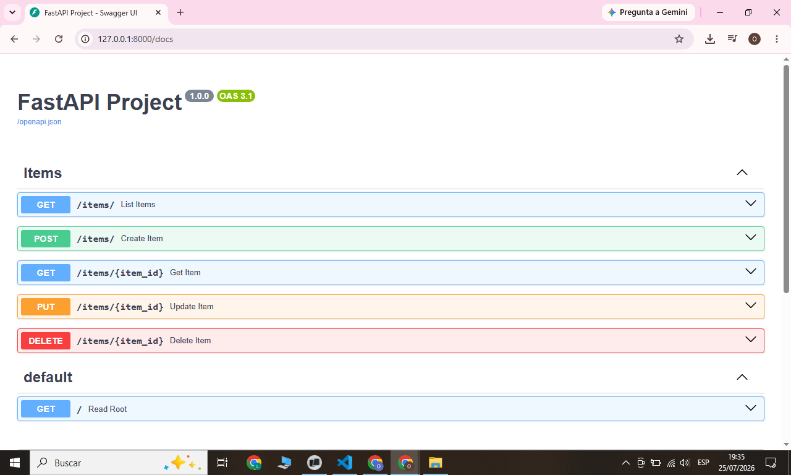

# 🚀 FastAPI Template

<p align="center">

**A production-ready FastAPI template built with modern Python best practices.**

Reusable, scalable and easy to maintain.

Designed for real-world REST API development.

</p>

<p align="center">


</p>

<p align="center">
  
</p>

---

# 📖 Overview

This project is a reusable FastAPI template created to accelerate backend development while following modern software engineering practices.

The template focuses on:

- Clean architecture
- Separation of responsibilities
- Scalability
- Maintainability
- Testability

Instead of starting every project from scratch, this template provides a solid foundation ready for production applications.

---

# ✨ Features

- ✅ FastAPI
- ✅ SQLAlchemy 2.0
- ✅ Pydantic v2
- ✅ Alembic Migrations
- ✅ Layered Architecture
- ✅ Repository Pattern
- ✅ Dependency Injection
- ✅ Environment Configuration
- ✅ Structured Logging
- ✅ Custom Exceptions
- ✅ Pytest Integration Tests
- ✅ 95% Test Coverage
- ✅ Production-ready Project Structure

---

# 🏛 Architecture

The application follows a layered architecture.

```text
                HTTP Request
                     │
                     ▼
               FastAPI Router
                     │
                     ▼
                  Service
                     │
                     ▼
                Repository
                     │
                     ▼
               SQLAlchemy ORM
                     │
                     ▼
                 Database
```

Each layer has a single responsibility.

| Layer | Responsibility |
|---------|----------------|
| Router | HTTP endpoints |
| Service | Business logic |
| Repository | Database access |
| Models | ORM entities |
| Schemas | Validation |
| Dependencies | Dependency Injection |
| Core | Configuration, Logging, Lifespan |

---

# 📁 Project Structure

```text
.
├── alembic/
├── app/
│   ├── api/
│   ├── core/
│   ├── database/
│   │   ├── models/
│   │   ├── base.py
│   │   └── session.py
│   ├── dependencies.py
│   ├── exceptions/
│   ├── repositories/
│   ├── routers/
│   ├── schemas/
│   ├── services/
│   └── main.py
│
├── docs/
├── tests/
├── .env.example
├── alembic.ini
├── pyproject.toml
└── README.md
```

---

# ⚙ Tech Stack

- Python 3.12
- FastAPI
- SQLAlchemy 2.0
- Alembic
- SQLite
- Pytest
- Uvicorn

---

# 🚀 Getting Started

## Clone the repository

```bash
git clone https://github.com/your-user/fastapi-template.git

cd fastapi-template
```

---

## Install dependencies

```bash
uv sync
```

---

## Configure environment

```bash
cp .env.example .env
```

---

## Apply database migrations

```bash
uv run alembic upgrade head
```

---

## Run the application

```bash
uv run uvicorn app.main:app --reload
```

---

# 🌐 API Documentation

Swagger UI

```
http://127.0.0.1:8000/docs
```

ReDoc

```
http://127.0.0.1:8000/redoc
```

---

# 🗄 Database Migrations

Generate a migration

```bash
uv run alembic revision --autogenerate -m "Describe your change"
```

Apply migrations

```bash
uv run alembic upgrade head
```

Rollback

```bash
uv run alembic downgrade -1
```

Current revision

```bash
uv run alembic current
```

---

# 🧪 Running Tests

Run all tests

```bash
uv run pytest
```

Run tests with coverage

```bash
uv run pytest --cov=app --cov-report=term-missing
```

Current project coverage

```
95%
```

---

# 🎯 Design Principles

This template follows several software engineering principles:

- Separation of Concerns
- Dependency Injection
- Repository Pattern
- SOLID Principles
- Layered Architecture
- Explicit Configuration
- Testable Code
- Versioned Database Schema

---

# 📚 Documentation

Project documentation is available inside the **docs/** directory.

- Architecture
- Project Rules
- API Conventions
- Database
- Testing

---

# 🚀 Development Workflow

```text
Create Model
      │
      ▼
Generate Migration
      │
      ▼
Apply Migration
      │
      ▼
Repository
      │
      ▼
Service
      │
      ▼
Router
      │
      ▼
Tests
      │
      ▼
Coverage
```

---

# 📈 Roadmap

## ✅ Version 1.0

- FastAPI
- SQLAlchemy 2.0
- Alembic
- CRUD
- Dependency Injection
- Repository Pattern
- Logging
- Tests
- 95% Coverage

---

## 🔜 Future Improvements

- JWT Authentication
- Role Based Authorization
- PostgreSQL
- Docker
- Docker Compose
- Async SQLAlchemy
- Redis
- Background Tasks
- GitHub Actions
- CI/CD

---

# 💼 Why This Template?

This project was created as a reusable backend foundation focused on professional software architecture rather than simple CRUD examples.

It aims to provide a clean starting point for building scalable REST APIs while applying modern backend development practices.

---

# 👤 Author

**Oscar Cáceres**

Python Backend Developer

- Backend APIs
- FastAPI
- SQLAlchemy
- Banking Technology
- Clean Architecture

GitHub:

https://github.com/csodcaceres

---

# 📄 License

MIT